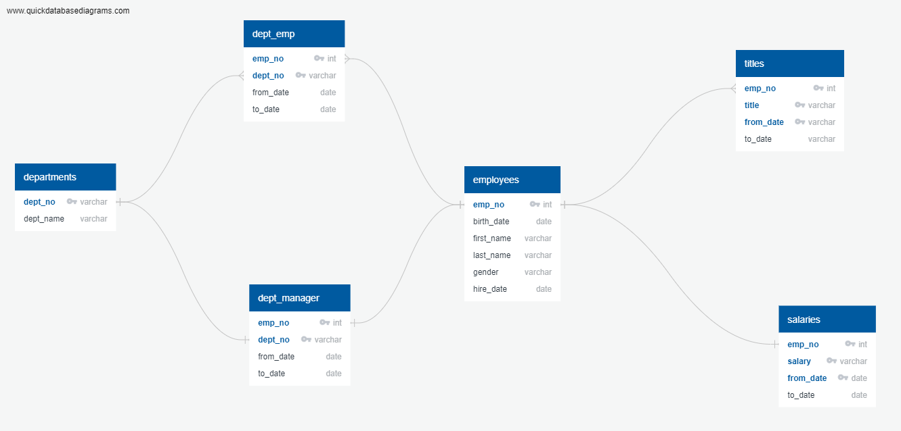
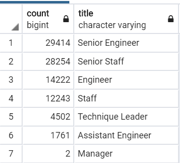

# Pewlett-Hackard-Analysis
## Overview
Pewlett-Hackard is a large company boasting thousands of employees. Company is looking ahead to future-proof their business as baby-boomers are retiring at rapid rate that they call 'Silver-Tsunami'. 

The objective of the project is to identify which employees are retiring and what kind of roles need to be filled in. 

Pewlett-Hackard would also like to put in a mentorship program: experienced and successful employees stepping back into a part-time role instead of retiring completely. Their new role in the company would be as a mentor to the newly hired folks. For this, they would like to know the employees who meet the mentorship eligibility criteria.

The csv data file that were provided:
1. [departments.csv](Data/departments.csv)
2. [dept_emp.csv](Data/dept_emp.csv)
3. [dept_manager.csv](Data/dept_manager.csv)
4. [employees.csv](Data/employees.csv)
5. [titles.csv](Data/titles.csv)
6. [salaries.csv](Data/sales_n_dev_retiring_emps.csv)

During this project we: 
1. Reviewed the exisiting datasets in CSV and created an ERD for PH employee database
2. Created database schemas on PostGresSQL using pgAdmin interface
3. Imported large employee data sets from CSV to SQL Databases
4. Wrote queries to create new tables using existing data sets for analyzing 'silver-tsunami'

The ERD diagram for the initial set of tables:

## Results
From the retirement data that was collected, following observations are made:
 - There are 90,398 employees that will be retiring. 
 - 63% of retiring staff have senior position; 29,414 are Senior Engineers and 28,254 are Senior Staff.  
 - Only 2 employees with Manager position are retiring.
 - There are only 1,549 employees are eligible for mentorship program.

   

  
## Summary
- *How many roles will need to be filled as the "silver tsunami" begins to make an impact?*
  To answer this question, we are going to get a count of total number of employees that are retiring.

    
    
  **The result of the query shows that there are 90,398 employees that will be retiring soon.**

- *Are there enough qualified, retirement-ready employees in the departments to mentor the next generation of Pewlett Hackard employees?*
 To answer this question, we needed to create an additional query to get total number of mentorship eligible employees categorized by their position.

   Title Count of Retiring Employees:

    
 
   Title Count of Mentorship Eligible Employees:

   

  **From the above two figures, it is clear that there are not enough qualified, reitrement-ready employees to mentor the next generation of Pewlett Hackard employees.** 

Additional query is written to include department names in the retiring table and mentorship table. 

Query for including department names in Unique titles table:

Query for including department names in the Mentorship Eligible table:

The two counts table is then joined to generate the following table that can be distributed to department heads. This will help them drill down within their department how many employees are retiring vs how many are eligible for each role.

